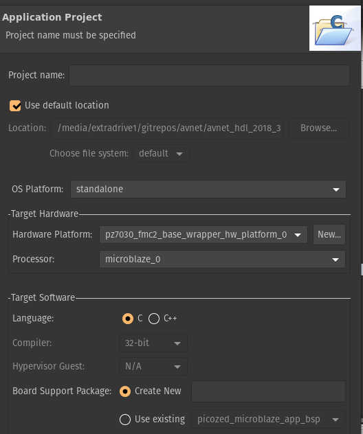
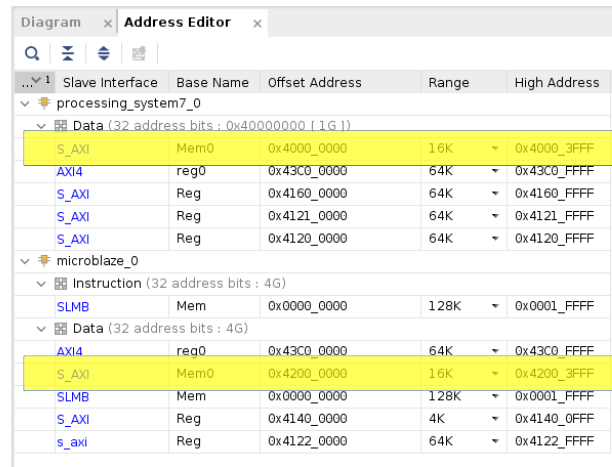
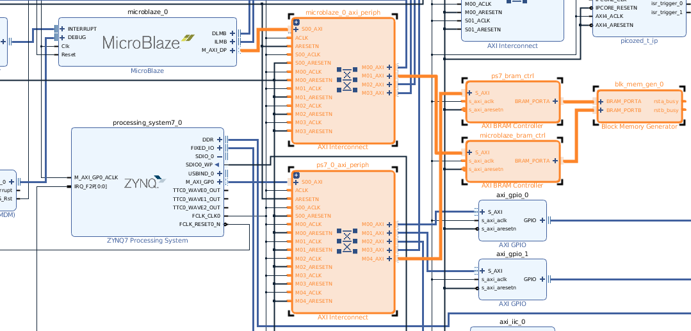
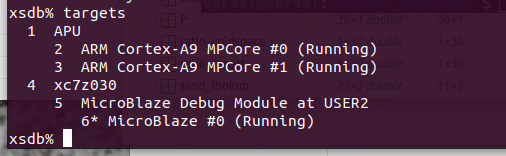
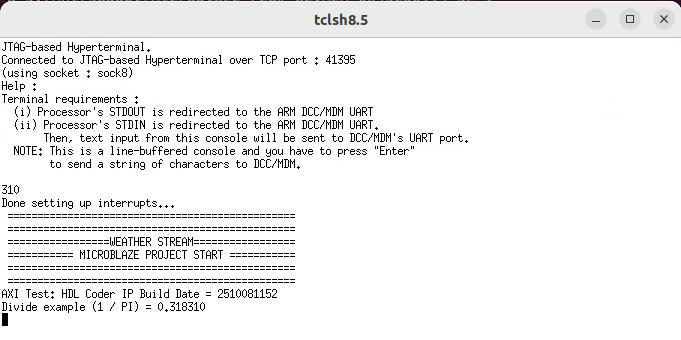
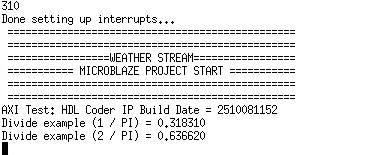
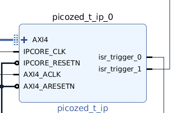
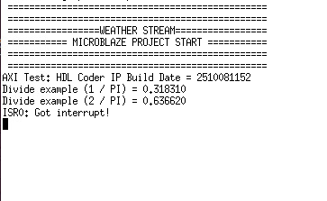
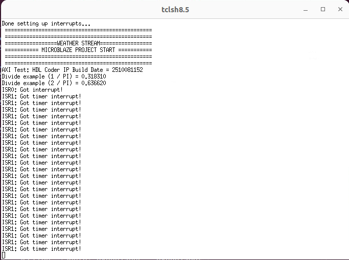
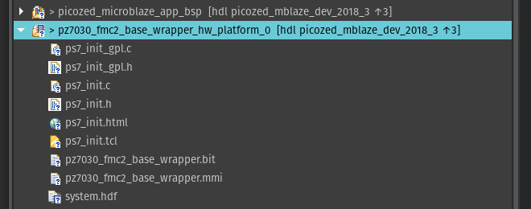

Microblaze Application Demo (SDK 2018.3)
=======================================

This repository will contain a source file for demonstrating shared 
memory access and interrupt routines with a Microblaze core.

To create the SDK project, use the generated HDF file (or the one provided in the HDL repo) to generate libraries, header-files, and other dependencies needed to compile an application. 
https://github.com/dleews/avnet_hdl/tree/picozed_mblaze_dev_2018_3/WsxProjects

Note that an HDF file is also provided in the link above.

New SDK Project 
=======================================

With Vivado SDK open, go to 
File-> Application Project



Give the project a name then assign the mblaze_demo_app.c file to the list of source files.

Memory map layout
=======================================

The high-lighted sections show the memory regions of interest



In this example, address 0x40000000 accesses a shared block-ram memory space that is made accessible to the ARM-Linux system. From the Microblaze poitn of view 0x42000000 accesses the same block-ram but using a different address. The reason why separate addresses are used is due to allow for simulatneous reads/write operations from both the Microblaze and the ARM PS7.



Despite having different addresses, you can still access the same data. For example, ARM-Linux writing a value 0xA to 0x40000004 will show up in 0x420000004 from the Microblaze.


Loading Microblaze Application via JTAG
=======================================

After compiling a Vivado SDK 2018.3 .elf binary file you can use the `xsdb` terminal to load in the Microblaze application. Ensure Linux is fully boot-able and able to load in an FPGA bit file. 

To access xsdb you will need to ensure the Vivado settings are on the path (ie: source (source /tools/Xilinx/Vivado/2018.3/settings64.sh).

1) With a JTAG cable plugged in you can then list the view of targets with the `targets` command



From there, type 

2) `target 6` to select the Microblaze JTAG target

3) `stop` to pause Microblaze execution

4) `dow <name of elf file>` to download the program application ELF file compiled from Vivado SDK

5) `jtagterminal` to bring up a terminal that will display printf statements from the application

6) `start` to resume execution - newly programmed applications will start at instruction address 0 (ie: from the beginning of the program)

7) `jtagterminal` will now update with printf statements 


 

Application Demos / Testing
=======================================

Shared memory can be demonstrated between ARM-Linux and the Microblaze core through some devmem commands:

``devmem 0x40000000 32 145``

The Microblaze C-application checks for changes in memory address values in the same shared memory space. If it notices a value change in 0x0, 0x4, 0x8 it will print to the screen a value:

```
void updateCountReg(uint32_t value)
{
	*bramPtr_countIdx = value; // update count register
	if (ENABLE_PRINT)
	{
		printf("Divide example (%d / PI) = %f  \n", value, (float)(value/M_PI));
	}

}
```

From there, the JTAG terminal will update as well:



Checks are done every 1000 milliseconds as it is performed in a while loop with a usleep( ) function.

For an interrupt demonstration, there are two ISRs that can be triggered with an IP core located at ``0x43C00000``. 



The call-backs are defined in the Microblaze application as such

```
void MyIsr_0(void *CallbackRef) {


	*((uint32_t *)AXI_IP_TEST_LATENCY_MEASURE) = 1;
    *((uint32_t *)AXI_IP_TEST_LATENCY_MEASURE) = 0;

    if (ENABLE_PRINT)
	{
    		printf("ISR0: Got interrupt! \n");
	}
}

void MyIsr_1(void *CallbackRef) {
	// Add your specific interrupt handling logic here
   //xil_printf("ISR1: Interrupt occurred! \n");
	globalValue += *bramPtr_countIdx  / M_PI;
	if (ENABLE_PRINT)
    {
		printf("ISR1: Got timer interrupt! \n");
    }
}
```

ISR0 can be triggered by accessing ``0x104``. By raising the value from 0 to 1 and ISR can be triggered. ie from the ARM-Linux side:

``devmem 0x43C00104 32 1``

The JTAG terminal will then respond




ISR1 on the other hand is defined as a timer interrupt which will periodically trigger at some specified clock cycle intervals. By default, a value of 1 second is used. To enable this ISR, use address ``0x114``.

``devmem 0x43C00114 32 1``

Then from the Microblaze JTAG terminal:




Other Info / Workflows
=======================================

Updating the HDF file for the SDK may be routinely required if certain changes are done to the FPGA project in Vivado. The HDF file is used by the Vivado SDK to generate header files that can help define memory addresses. For example, the pointer address values used in the C-code can be found in xparameters.h. Here is an example of what is generated from the shared memory space Block RAM IP:

```
/* Definitions for peripheral MICROBLAZE_BRAM_CTRL */
#define XPAR_MICROBLAZE_BRAM_CTRL_DEVICE_ID 2U
#define XPAR_MICROBLAZE_BRAM_CTRL_DATA_WIDTH 32U
#define XPAR_MICROBLAZE_BRAM_CTRL_ECC 0U
#define XPAR_MICROBLAZE_BRAM_CTRL_FAULT_INJECT 0U
#define XPAR_MICROBLAZE_BRAM_CTRL_CE_FAILING_REGISTERS 0U
#define XPAR_MICROBLAZE_BRAM_CTRL_UE_FAILING_REGISTERS 0U
#define XPAR_MICROBLAZE_BRAM_CTRL_ECC_STATUS_REGISTERS 0U
#define XPAR_MICROBLAZE_BRAM_CTRL_CE_COUNTER_WIDTH 0U
#define XPAR_MICROBLAZE_BRAM_CTRL_ECC_ONOFF_REGISTER 0U
#define XPAR_MICROBLAZE_BRAM_CTRL_ECC_ONOFF_RESET_VALUE 0U
#define XPAR_MICROBLAZE_BRAM_CTRL_WRITE_ACCESS 0U
#define XPAR_MICROBLAZE_BRAM_CTRL_S_AXI_BASEADDR 0x42000000U
#define XPAR_MICROBLAZE_BRAM_CTRL_S_AXI_HIGHADDR 0x42003FFFU
#define XPAR_MICROBLAZE_BRAM_CTRL_S_AXI_CTRL_BASEADDR 0xFFFFFFFFU 
#define XPAR_MICROBLAZE_BRAM_CTRL_S_AXI_CTRL_HIGHADDR 0xFFFFFFFFU 
```

If changes to memory addresses are added (ie: from adding a new IP on the AXI bus) then you can re-generate the headers like so:

1) Swap in a new HDF file and replace the existing one that the SDK is pointing to

2) Vivado SDK will prompt you with regenerating source files, press yes

3) Alternatively, if you want to spaw HDF files to a new location you can right click and set it here as follows:



And select Change Hardware Platform Specification

4) Go through the prompts and select a different HDF file


